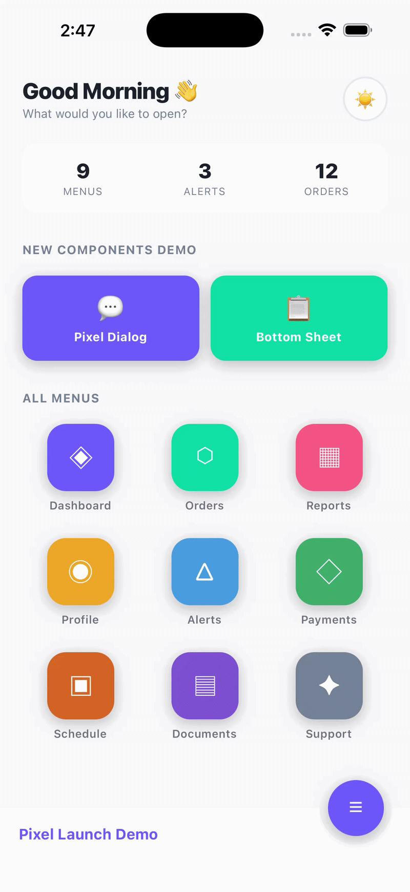

# react-native-pixel-launch

Pixel Launcher-style animations for React Native and Expo — overlay transitions, dialogs, bottom sheets, dome footer with FAB menu, and categorized menu grid with search.

## Preview

| v1.0 — Pixel Launch Overlay | v1.1 — Full Component Suite |
|:---:|:---:|
| .gif>) |  |

## Features

- **PixelLaunchContainer** — Full-screen overlay that scales from any element (like Android's Pixel Launcher app-open animation)
- **PixelDialog** — Custom alert dialog that expands from an origin point to screen center
- **AnimatedBottomSheet** — Bottom sheet with slide animation + stagger items
- **DomeFooter** — SVG dome bar footer with circular FAB button cutout
- **FabMenu** — Expandable floating action button menu with staggered spring animations
- **PixelMenuGrid** — Data-driven, categorized icon grid with scale-on-press animation
- **PixelMenuOverlay** — Search bar + categorized menu grid combo
- Runs on the native thread (`useNativeDriver: true`) for smooth 60/120 Hz
- Works with both Expo and bare React Native
- TypeScript support built-in
- Zero required dependencies (only `react` and `react-native`)
- Optional `react-native-svg` peer dependency (only needed for `DomeFooter`)

## Installation

```bash
npm install react-native-pixel-launch
# or
yarn add react-native-pixel-launch
```

If you want to use `DomeFooter` / `FabMenu`, also install:

```bash
npm install react-native-svg
```

---

## Components

### 1. PixelLaunchContainer

Full-screen overlay that scales up from an origin rect and collapses back on close.

```tsx
import { useState, useRef } from "react";
import { View, TouchableOpacity, Text } from "react-native";
import { PixelLaunchContainer, type LaunchOrigin } from "react-native-pixel-launch";

export default function App() {
  const [visible, setVisible] = useState(false);
  const [origin, setOrigin]   = useState<LaunchOrigin | null>(null);
  const btnRef                = useRef<View>(null);

  const handleOpen = () => {
    btnRef.current?.measure((_x, _y, width, height, pageX, pageY) => {
      setOrigin({ x: pageX, y: pageY, width, height });
      setVisible(true);
    });
  };

  return (
    <View style={{ flex: 1 }}>
      <TouchableOpacity ref={btnRef} onPress={handleOpen}>
        <Text>Open</Text>
      </TouchableOpacity>

      <PixelLaunchContainer
        visible={visible}
        origin={origin}
        onClose={() => setVisible(false)}
        onDismissed={() => console.log("fully closed")}
        backgroundColor="#FFFFFF"
      >
        <View style={{ flex: 1, alignItems: "center", justifyContent: "center" }}>
          <Text>Your screen content here</Text>
          <TouchableOpacity onPress={() => setVisible(false)}>
            <Text>Close</Text>
          </TouchableOpacity>
        </View>
      </PixelLaunchContainer>
    </View>
  );
}
```

#### Props

| Prop | Type | Required | Default | Description |
|------|------|----------|---------|-------------|
| `visible` | `boolean` | Yes | -- | Controls open/close state |
| `origin` | `LaunchOrigin \| null` | Yes | -- | Screen-absolute rect of the trigger element |
| `onClose` | `() => void` | Yes | -- | Called when user wants to close |
| `onDismissed` | `() => void` | No | -- | Called after close animation completes |
| `backgroundColor` | `string` | No | `"#FFFFFF"` | Overlay background colour |
| `zIndex` | `number` | No | `200` | zIndex of the overlay |
| `children` | `ReactNode` | Yes | -- | Content rendered inside the overlay |

---

### 2. PixelDialog

Custom dialog that replaces native Alert — scales from an origin point to screen center.

```tsx
import { PixelDialog } from "react-native-pixel-launch";

<PixelDialog
  visible={showDialog}
  origin={dialogOrigin}
  title="Delete Item?"
  message="This action cannot be undone."
  icon={<MyIcon />}
  buttons={[
    { label: "Cancel", style: "cancel", onPress: () => setShowDialog(false) },
    { label: "Delete", style: "destructive", onPress: handleDelete },
  ]}
  onDismiss={() => setShowDialog(false)}
/>

{/* Custom button colors */}
<PixelDialog
  visible={showContact}
  origin={contactOrigin}
  title="Contact"
  message="How would you like to reach out?"
  buttons={[
    { label: "Call", style: "default", onPress: handleCall },
    { label: "WhatsApp", color: "#25D366", onPress: handleWhatsApp },
    { label: "Cancel", style: "cancel", onPress: () => setShowContact(false) },
  ]}
  onDismiss={() => setShowContact(false)}
/>
```

#### Props

| Prop | Type | Required | Default | Description |
|------|------|----------|---------|-------------|
| `visible` | `boolean` | Yes | -- | Controls visibility |
| `origin` | `LaunchOrigin \| null` | Yes | -- | Origin rect of trigger element |
| `title` | `string` | Yes | -- | Dialog title |
| `message` | `string` | No | -- | Body text below title |
| `icon` | `ReactNode` | No | -- | Icon rendered above the title |
| `buttons` | `PixelDialogButton[]` | Yes | -- | Array of buttons |
| `onDismiss` | `() => void` | No | -- | Called on backdrop tap |

#### PixelDialogButton

```ts
type PixelDialogButton = {
  label: string;
  style?: "default" | "cancel" | "destructive";
  color?: string;  // Custom text color — overrides style
  onPress: () => void;
};
```

---

### 3. AnimatedBottomSheet

Bottom sheet with slide-up animation, drag-to-dismiss, and stagger items.

```tsx
import { AnimatedBottomSheet, StaggerItem } from "react-native-pixel-launch";

<AnimatedBottomSheet
  visible={isOpen}
  onClose={() => setIsOpen(false)}
  title="Options"
  bottomOffset={80}
  backgroundColor="#FFFFFF"
>
  <StaggerItem index={0}><Text>Row 1</Text></StaggerItem>
  <StaggerItem index={1}><Text>Row 2</Text></StaggerItem>
  <StaggerItem index={2}><Text>Row 3</Text></StaggerItem>
</AnimatedBottomSheet>
```

#### Props

| Prop | Type | Required | Default | Description |
|------|------|----------|---------|-------------|
| `visible` | `boolean` | Yes | -- | Controls open/close |
| `onClose` | `() => void` | Yes | -- | Called on backdrop tap or swipe down |
| `title` | `string` | No | -- | Header title |
| `bottomOffset` | `number` | No | `0` | Distance from screen bottom |
| `originX` | `number` | No | center | X position the sheet scales from |
| `maxHeightRatio` | `number` | No | `0.80` | Max height as fraction of screen |
| `backgroundColor` | `string` | No | `"#FFFFFF"` | Sheet background color |
| `titleColor` | `string` | No | `"#111827"` | Title text color |
| `handleColor` | `string` | No | `"#E5E7EB"` | Drag handle color |
| `dividerColor` | `string` | No | `"#F3F4F6"` | Divider line color |
| `backdropMaxOpacity` | `number` | No | `0.45` | Backdrop opacity when open |
| `children` | `ReactNode` | No | -- | Sheet content |

---

### 4. DomeFooter

SVG dome bar footer with circular cutout for a floating action button.

```tsx
import { DomeFooter, FOOTER_BAR_H } from "react-native-pixel-launch";
import { useSafeAreaInsets } from "react-native-safe-area-context";

function MyFooter() {
  const insets = useSafeAreaInsets();
  const barH = FOOTER_BAR_H + insets.bottom;

  return (
    <DomeFooter
      barH={barH}
      primaryColor="#6C63FF"
      footerColor="#1E1E30"
      brandText="My App"
      isFabOpen={fabOpen}
      isSheetOpen={sheetOpen}
      isMenuOpen={menuOpen}
      onToggleFab={() => setFabOpen(!fabOpen)}
      onCloseSheet={() => setSheetOpen(false)}
      onCloseMenu={() => setMenuOpen(false)}
      renderIcon={(name) => (
        <Text style={{ color: "#FFF", fontSize: 22 }}>
          {name === "menu" ? "☰" : "✕"}
        </Text>
      )}
    />
  );
}
```

#### Props

| Prop | Type | Required | Default | Description |
|------|------|----------|---------|-------------|
| `barH` | `number` | Yes | -- | Total bar height (FOOTER_BAR_H + safe area) |
| `primaryColor` | `string` | Yes | -- | Brand colour for FAB button |
| `footerColor` | `string` | Yes | -- | Footer bar background colour |
| `brandText` | `string` | No | `""` | Text shown on the footer bar |
| `onBack` | `() => void` | No | -- | Sub-screen mode: shows close button |
| `isSheetOpen` | `boolean` | No | `false` | Whether a sheet overlay is open |
| `isFabOpen` | `boolean` | No | `false` | Whether the FAB menu is open |
| `isMenuOpen` | `boolean` | No | `false` | Whether the menu is open |
| `onCloseSheet` | `() => void` | No | -- | Close sheet callback |
| `onToggleFab` | `() => void` | No | -- | Toggle FAB menu callback |
| `onCloseMenu` | `() => void` | No | -- | Close menu callback |
| `renderIcon` | `(name) => ReactNode` | No | -- | Custom icon renderer |

---

### 5. FabMenu

Expandable floating action button menu with staggered spring animations.

```tsx
import { FabMenu } from "react-native-pixel-launch";

<FabMenu
  isOpen={fabOpen}
  bottomOffset={barH}
  primaryColor="#6C63FF"
  items={[
    {
      key: "menu",
      icon: <Text style={{ color: "#FFF" }}>☰</Text>,
      label: "Menu Items",
      onPress: () => openMenu(),
    },
    {
      key: "settings",
      icon: <Text style={{ color: "#FFF" }}>⚙</Text>,
      label: "Settings",
      onPress: () => openSettings(),
    },
  ]}
  onClose={() => setFabOpen(false)}
/>
```

#### Props

| Prop | Type | Required | Default | Description |
|------|------|----------|---------|-------------|
| `isOpen` | `boolean` | Yes | -- | Controls menu visibility |
| `bottomOffset` | `number` | Yes | -- | Distance from screen bottom |
| `primaryColor` | `string` | Yes | -- | Colour for FAB buttons |
| `items` | `FabMenuItem[]` | Yes | -- | Menu items to display |
| `onClose` | `() => void` | Yes | -- | Close callback |

---

### 6. PixelMenuGrid

Data-driven, categorized icon grid with scale-on-press animation and LaunchOrigin measurement.

```tsx
import { PixelMenuGrid, type PixelMenuItem } from "react-native-pixel-launch";
import Icon from "@expo/vector-icons/MaterialCommunityIcons";

type MyItem = PixelMenuItem & { icon: string };

const items: MyItem[] = [
  { key: "home", title: "Home", icon: "home", color: "blue", category: "Main", order: 1 },
  { key: "chat", title: "Chat", icon: "chat", color: "green", category: "Main", order: 2 },
  { key: "settings", title: "Settings", icon: "cog", color: "gray", category: "Other", order: 3 },
];

<PixelMenuGrid
  items={items}
  primaryColor="#6C63FF"
  renderIcon={(item, color, size) => (
    <Icon name={item.icon as any} size={size} color={color} />
  )}
  onItemPress={(item, origin) => {
    // origin has { x, y, width, height } for PixelLaunchContainer
    console.log("Pressed", item.title, origin);
  }}
/>
```

#### Props

| Prop | Type | Required | Default | Description |
|------|------|----------|---------|-------------|
| `items` | `PixelMenuItem[]` | No | -- | Flat list (auto-grouped by category) |
| `sections` | `PixelMenuSection[]` | No | -- | Pre-grouped sections |
| `renderIcon` | `(item, color, size) => ReactNode` | Yes | -- | Icon renderer |
| `onItemPress` | `(item, origin) => void` | No | -- | Press callback with measured position |
| `searchTerm` | `string` | No | `""` | Filter items by title |
| `primaryColor` | `string` | No | `"#2563EB"` | Accent color for section headers |
| `iconCircleColor` | `string` | No | `"#FFFFFF"` | Icon circle background |
| `labelColor` | `string` | No | `"#1F2937"` | Card label text color |
| `columns` | `number` | No | `4` | Number of grid columns |
| `iconSize` | `number` | No | `64` | Icon circle diameter |
| `bottomPadding` | `number` | No | `0` | Extra bottom padding |

---

### 7. PixelMenuOverlay

Search bar + categorized menu grid combo. Manages search state internally.

```tsx
import { PixelMenuOverlay } from "react-native-pixel-launch";

<PixelMenuOverlay
  items={menuItems}
  primaryColor="#6C63FF"
  iconCircleColor="#1E1E30"
  labelColor="#CBD5E0"
  searchBackgroundColor="#1E1E30"
  searchTextColor="#FFFFFF"
  searchPlaceholderColor="#718096"
  bottomPadding={100}
  renderIcon={(item, color, size) => (
    <Icon name={item.icon} size={size} color={color} />
  )}
  onItemPress={(item, origin) => openScreen(item, origin)}
/>
```

#### Props

Inherits all `PixelMenuGrid` props (except `searchTerm`) plus:

| Prop | Type | Required | Default | Description |
|------|------|----------|---------|-------------|
| `searchPlaceholder` | `string` | No | `"Search in menu"` | Input placeholder |
| `searchBackgroundColor` | `string` | No | `"#FFFFFF"` | Search pill background |
| `searchTextColor` | `string` | No | `"#202124"` | Search input text color |
| `searchPlaceholderColor` | `string` | No | `"#9AA0A6"` | Placeholder text color |
| `searchShadowColor` | `string` | No | primaryColor | Search pill shadow color |
| `renderSearchIcon` | `() => ReactNode` | No | -- | Custom search icon |
| `renderClearIcon` | `() => ReactNode` | No | -- | Custom clear icon |
| `showSearch` | `boolean` | No | `true` | Show/hide search bar |
| `headerContent` | `ReactNode` | No | -- | Content above search bar |

---

## Types

### LaunchOrigin

```ts
type LaunchOrigin = {
  x: number;      // pageX from ref.measure()
  y: number;      // pageY from ref.measure()
  width: number;
  height: number;
};
```

### PixelMenuItem

```ts
type PixelMenuItem = {
  key: string;        // Unique identifier
  title: string;      // Display label
  color?: string;     // Icon color (hex or named: "red", "blue", etc.)
  category?: string;  // Section grouping
  order?: number;     // Sort order within category
};
```

### PixelMenuSection

```ts
type PixelMenuSection<T extends PixelMenuItem = PixelMenuItem> = {
  category: string;
  items: T[];
};
```

### FabMenuItem

```ts
type FabMenuItem = {
  key: string;
  icon: React.ReactNode;
  label: string;
  onPress: () => void;
};
```

## Exported Constants

| Constant | Value | Description |
|----------|-------|-------------|
| `FOOTER_BAR_H` | `56` | Footer bar height (without safe area) |
| `DOME_R` | `50` | Dome radius |
| `DOME_CX` | `screenWidth - 58` | Dome center X position |
| `BTN_R` | `30` | FAB button radius |
| `CUP_RIM_R` | `39` | Dome cutout rim radius |

## Named Colors

`PixelMenuGrid` resolves named colors automatically:

`red` `orange` `yellow` `green` `teal` `blue` `indigo` `violet` `purple` `pink` `cyan` `gray` `brown` `lime` `amber`

You can extend or override these with the `namedColors` prop.

## Changelog

### v1.1.1
- **PixelDialog**: Added optional `color` prop to `PixelDialogButton` for custom button text colors. Overrides the `style` preset when provided.

## License

MIT — made by [Sourabh Patidar](https://github.com/Saurabh0904)
